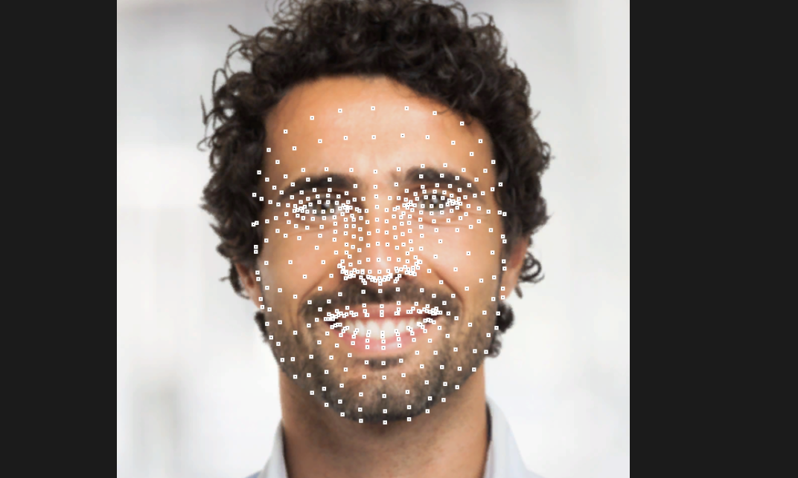

# Face Landmark from Google Mediapipe validated for Unity Sentis (Version 1.4.0-pre.2*)
*Version 1.3.0 Sentis files are not compatible with Sentis 1.4.0 and need to be recreated/downloaded

This is the [Face Landmark model](https://developers.google.com/mediapipe/solutions/vision/face_landmarker) from Google in the Sentis format.

The model detects 468 3D markers on a face centered in an image. You could use these markers, for example, to control a Mesh. For example [this one](https://github.com/google/mediapipe/blob/master/mediapipe/modules/face_geometry/data/canonical_face_model.obj) in obj format.

**IMPORTANT:** The face needs to be centered and cropped to fit the image. For images with faces not in the center or for multiple faces, you will need another model to detect faces, and crop them before feeding them into this model. For example you could use [Blaze Face](https://huggingface.co/unity/sentis-blaze-face) to detect them.

## How to Use
* Create a new scene in Unity 2023
* Put the face_landmark.sentis file in the `Assets/StreamingAssets` folder
* Install package `com.unity.sentis` version `1.4.0-pre.2` from the package manager
* Put a video in the `Assets/StreamingAssets` folder and set `videoName` variable to the video name
* Create a RawImage and place it in your scene. Link to this image in the `previewUI` field.

## Preview
If you get it working it should look like this (original image from pexels.com):

## License
All Google Mediapipe models are open source under the Apache 2.0 license. The accompanying C# source code we provide can be used in your applications for commercial purposes.